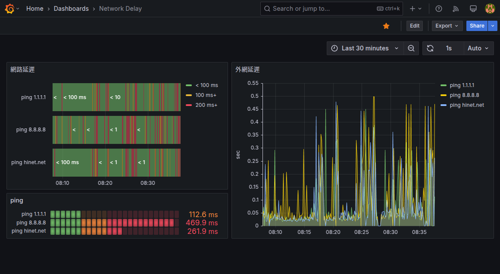
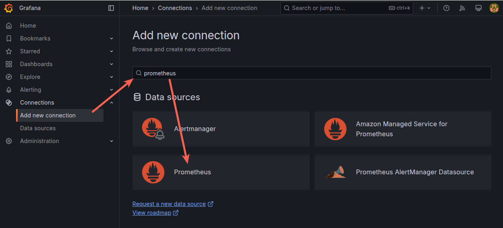
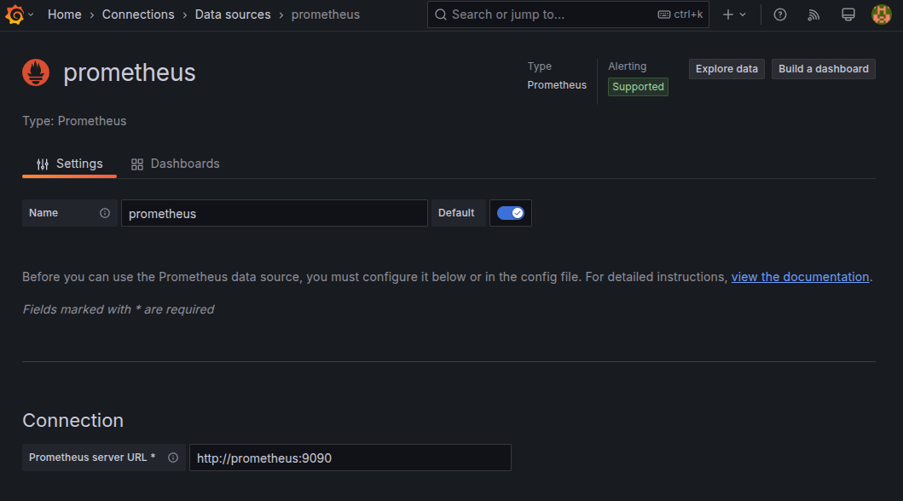
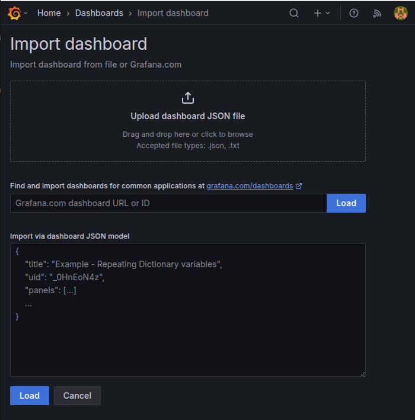

# Readme

Network Delay Dashboard




## Quick Start

- 複製版本庫

```shell
git clone network_delay_dashboard
cd network_delay_dashboard
```

- 透過docker啟動採集器與顯示圖表的網頁

```shell
docker compose up -d
```

- 開啟瀏覽器接入網頁 [http://localhost:30000/](http://localhost:30000/)

- 設定第一次啟動的帳號密碼

預設帳密都是 `admin` 定義

- 設定接入的資料來源

從網頁上前往 `Home` > `Connections` > `Add new connection` 

選擇資料來源 `Prometheus`



設定的數值基本都是用預設值，只有 `connection` 是設定 `http://prometheus:9090` ，完成後就可以點選 `Save & Test` 按鈕測試有沒有錯誤



- 匯入dashboard `./dashboard/Network Delay.json/`



